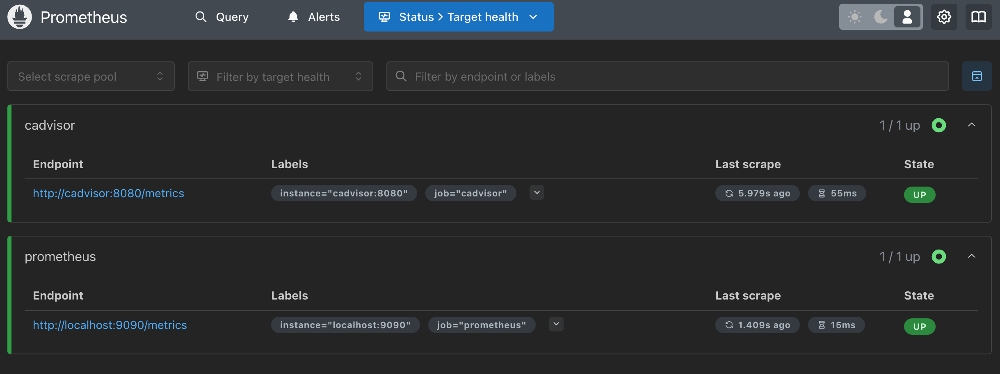
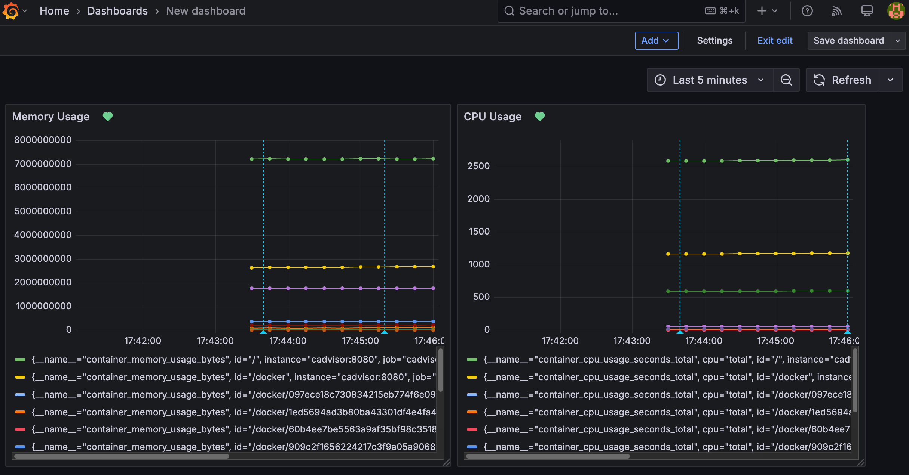

# DevOps Test Task

## Objective
Create a simple infrastructure that includes:
- A CI/CD pipeline for a containerized application.
- System monitoring.
- Documentation of the work done.

## Task Description

### 1. Creating and Configuring a CI/CD Pipeline

The following tools were used to create the pipeline:
- **Jenkins** using DSL scripts to create the pipeline.
- **Docker** for containerizing a Python application.
- **GitHub** for code storage.

#### Pipeline Stages:
1. **Building a Docker image** for the Python application.
2. **Deploying the container** on a local machine or virtual machine using Docker Compose.
3. **Automatic testing of the application** (e.g., checking the response to an HTTP request).

### 2. Setting Up Monitoring

The following tools were used for monitoring:
- **Prometheus** for collecting metrics.
- **Grafana** for visualizing metrics.
- **cAdvisor** for container monitoring.

#### Key Metrics:
1. CPU usage.
2. Memory usage by containers.

#### Alerts:
- Alerts are configured for high CPU load or high memory usage.

### 3. Documentation

The documentation describes:
1. The process of deploying and configuring the CI/CD pipeline.
2. Setting up monitoring and configuring alerts.

### 4. Additional (Optional)

1. Optimizing the pipeline for faster builds.
2. Adding scripts to automate simple tasks (e.g., creating backups or restarting a container on command).

---

## Setup Instructions

---

### 1. Preparing the Environment

1. Install **Docker** and **Docker Compose**:
   - [Docker Installation Guide](https://docs.docker.com/get-docker/)
   - [Docker Compose Installation Guide](https://docs.docker.com/compose/install/)

2. Build a custom image (with pre-installed Docker) for **Jenkins**:
   - Use the Docker image for Jenkins:
     ```bash
     docker build -t custom-jenkins-docker:lts .
     ```

---

### 2. Project Structure
├── Jenkins
│   ├── Dockerfile
│   └── Jenkinsfile
├── README.md
├── docker-compose.yml
├── docker_restart_status.sh
├── prometheus
│   └── prometheus.yml
└── python-app
    ├── Dockerfile
    ├── app.py
    ├── docker-compose.yml
    └── requirements.txt

---

### 3. Running the Infrastructure

1. Initially, use **docker-compose** to start Jenkins, Grafana, Prometheus, and Cadvisor (container monitoring):
   ```bash
   docker-compose up -d
   ```

---

### 4. Jenkins Configuration
1. Create a GitHub Personal Access Token with repo permissions from GitHub settings.

2. Add Credentials to Jenkins:
    - Go to Manage Jenkins → Manage Credentials → choose your credentials store (e.g., (global)).
    - Click Add Credentials.
    - Select Username with password, provide your GitHub username and the generated token as the password.

3. Link GitHub Repository to Jenkins:
    - Create a new Jenkins pipeline job.
    - Under Source Code Management, select Git, and provide the repository URL.
    - Select the credentials you've created for GitHub.

---

### 5. Running the Pipeline
After the Jenkins job is created and configured, trigger the pipeline manually from Jenkins.

Jenkins will automatically:
    - Clone the repository.
    - Build the Docker image.
    - Run tests.
    - Push the image to the Docker registry.
    - Deploy the application using Docker Compose.

---

### 6. Checking Targets in Prometheus

### Steps to Check Targets in Prometheus:

1. **Access Prometheus**:
   - Open your browser and go to `http://localhost:9090`.

2. **Check Targets**:
   - In the Prometheus web interface, click on **Status** in the top menu.
   - Then, select **Targets**.
   - This page shows a list of all configured targets Prometheus is scraping data from.
   - You should see targets like `cadvisor`, `grafana`, and any other services you have configured (like your Python application).

3. **Verify Target Status**:
   - The **last scrape** column will show the last time Prometheus successfully scraped data from a target.
   - The **target** column will list the name of each service or container being monitored (e.g., `cadvisor`, `python-app`).
   - The **health** column should show `up` if Prometheus is successfully collecting metrics from the target.
   - If any target is showing `down`, check the logs of the related container or service to troubleshoot connectivity or configuration issues.

### Example Screenshot:



The Prometheus **Targets** page will show the following:
- `cadvisor` and `grafana` as targets, both with a status of `up`.
- Each target will have its endpoint listed, and Prometheus will show the last time it scraped the target.

---

### 7. Setting Up Dashboards in Grafana

Grafana is a powerful tool for visualizing metrics collected by Prometheus. To create useful dashboards in Grafana, we need to configure data sources and build visualizations based on the metrics collected by Prometheus.

### Steps to Set Up Grafana Dashboards:

1. **Access Grafana**:
   - Open your browser and go to `http://localhost:3000`.
   - The default login credentials are:
     - **Username**: `admin`
     - **Password**: `admin` (you will be prompted to change the password after logging in).

2. **Configure Prometheus as a Data Source**:
   - Once logged in, click on the **Gear Icon** (Settings) on the left sidebar, then select **Data Sources**.
   - Click on **Add data source** and select **Prometheus** from the list.
   - In the **URL** field, enter the URL of your Prometheus instance, e.g., `http://localhost:9090`.
   - Click **Save & Test** to ensure Grafana can communicate with Prometheus.

3. **Create a New Dashboard**:
   - Click on the **Plus Icon** (+) in the left sidebar and select **Dashboard**.
   - Click **Add new panel** to start adding visualizations to your dashboard.

4. **Configure Panels for Monitoring**:
   - In the **Query** section of the panel, select **Prometheus** as the data source.
   - You can now enter a Prometheus query to display specific metrics.
     - For example, to display CPU usage, use the query `rate(container_cpu_usage_seconds_total[1m])`.
     - For memory usage, use the query `container_memory_usage_bytes`.
   - You can adjust the panel type (e.g., Graph, Gauge, etc.) depending on how you want the metric to be visualized.

5. **Save the Dashboard**:
   - Once you’ve configured all the panels, click **Save** on the top of the screen.
   - Provide a name for the dashboard and click **Save** again.

### Example Screenshot:




### 8. Docker Container Management Script (docker_restart_status.sh)

This script allows you to manage Docker containers by either restarting them or checking their status.

#### Features:
- **Restart a container** if it’s running.
- **Check the status** of a container (running, stopped, etc.).

#### How to use:
1. **Make it executable**:
   ```bash
   chmod +x docker_restart_status.sh
   ```

2. **Run the script**:
   ```bash
   ./docker_restart_status.sh
   ```

3. **Enter container name** when prompted.

4. **Choose an action**:
   - **1**: Restart the container.
   - **2**: Check the container status.
   - **3**: Exit.

#### Example:
```bash
Enter the container name: my-container
Choose an action:
1. Restart container my-container
2. Check the status of container my-container
3. Exit
Choice (1-3): 1
Restarting container my-container...
Container my-container has been restarted.
```

This script provides a simple way to manage Docker containers from the command line.